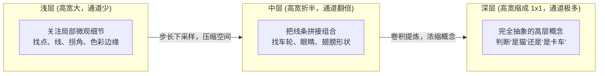
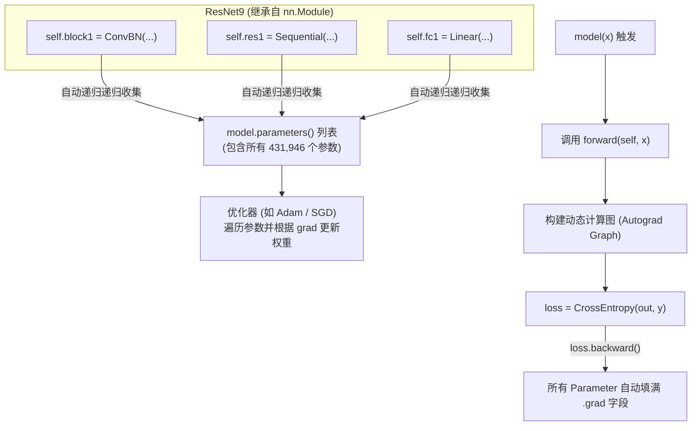

# 从零构建现代卷积神经网络：从特征提取、BatchNorm、残差网络到全流程实现的体系化指南

---

## 前言：写给没有读过论文、没有听过课的工程开发者

很多教科书一上来就堆砌一堆论文名词：“高层语义、平移等变性、协变量偏移、凸优化”，让人望而生畏。但实际上，现代深度学习计算机视觉系统（CNN / ResNet）的核心物理图像极其朴素直观。

这篇笔记**不预设你学过任何论文或网课**。我们将从最基础的**“计算机怎么看一张图”**开始，像搭积木一样，把现代视觉网络的每一个零件为什么存在、怎么工作、在代码里如何体现，完整、立体地串联起来。

---

## 目录
1. [视觉世界的编码：从原始像素到特征图（Feature Map）](#1-视觉世界的编码从原始像素到特征图feature-map)
2. [为什么不能只有卷积？激活函数（ReLU）的生死意义](#2-为什么不能只有卷积激活函数relu的生死意义)
3. [批归一化（BatchNorm）：让深层网络平静下来的“镇静剂”](#3-批归一化batchnorm让深层网络平静下来的镇静剂)
4. [残差连接（ResNet）：深度学习史上最伟大的“抄近道”](#4-残差连接resnet深度学习史上最伟大的抄近道)
5. [从特征到决策：分类头（Classification Head）与 Logits](#5-从特征到决策分类头classification-head与-logits)
6. [ResNet-9 全景架构图与张量全生命周期追踪](#6-resnet-9-全景架构图与张量全生命周期追踪)
7. [面向对象系统架构：Module、Parameter 与底层算子如何联动](#7-面向对象系统架构moduleparameter-与底层算子如何联动)

---

## 1. 视觉世界的编码：从原始像素到特征图（Feature Map）

### 1.1 什么是通道（Channel）？
拿手机拍一张照片，在计算机里其实是一个立体的数据块：
* **高（$H$）** 和 **宽（$W$）**：像素网格的位置（比如 $32 \times 32$ 个格子）；
* **通道（$C$）**：每个格子里记录的信息维度。
  * 刚输入的原始图像只有 **3 个通道**（R、G、B），分别记录这个像素点红、绿、蓝三种光的强度。

### 1.2 什么是特征图（Feature Map）？
在网络里，数据经过一层卷积之后，形状从 $(3, 32, 32)$ 变成了 $(16, 8, 8)$。
很多初学者会懵：**“通道数怎么从 3 变成了 16？这 16 个通道里装的到底是什么鬼东西？”**

> [!IMPORTANT]
> **这 16 个通道不再是颜色，而是 16 种不同“特征”的检测强度热力图！**

* 第 0 个卷积核专门负责找“水平线条”：它扫完整张图，输出第 0 个通道。图里哪里有水平线，第 0 通道对应的位置数值就很大（亮起来）；
* 第 1 个卷积核专门负责找“垂直线条”：输出第 1 个通道；
* 第 2 个卷积核专门负责找“圆弧斑点”；
* ...
* 第 15 个卷积核专门负责找“对角斜线”。

这 16 张图叠加在一起，就叫 **特征图（Feature Map）**！它记录了整张图片在各个空间位置上，分别存在哪些基础图形。

### 1.3 核心演化规律：为什么尺寸越变越小，通道数越变越多？
请观察我们接下来要写的 ResNet-9 的形状演变：
$$\mathbf{(3,\; 32,\; 32)} \longrightarrow \mathbf{(16,\; 8,\; 8)} \longrightarrow \mathbf{(32,\; 4,\; 4)} \longrightarrow \mathbf{(64,\; 2,\; 2)} \longrightarrow \mathbf{(128,\; 1,\; 1)}$$

为什么高宽从 $32 \to 8 \to 4 \to 2 \to 1$，而通道数却从 $3 \to 16 \to 32 \to 64 \to 128$？



1. **高宽变小（空间下采样）**：
   我们不需要在最后还精确知道“猫耳朵位于第几行第几列”，我们只需要知道“这图里到底有没有猫耳朵”。因此通过步长（Stride）不断让分辨率减半，压缩位置冗余。
2. **通道变多（语义丰富度）**：
   微观线条只有几种（横、竖、撇、捺，几个通道就够了）；但由线条组合出来的高层零件成百上千（车轮、门把手、猫须、狗鼻子...），因此必须用越来越多的通道来容纳这些高级特征！
3. **感受野（Receptive Field）滚雪球**：
   浅层的卷积核每次只看 $3 \times 3$ 个像素，管中窥豹；但经过步长为 2 的下采样后，深层的 1 个像素其实汇聚了原本原图上一大片几十个像素的信息！

---

## 2. 为什么不能只有卷积？激活函数（ReLU）的生死意义

在我们的模块 `ConvBN` 中，三部曲里最后一步是 `ReLU()`：
$$\text{Conv} \longrightarrow \text{BatchNorm} \longrightarrow \mathbf{ReLU}$$

什么是 ReLU？它的数学公式简单到让人不敢相信：
$$\text{ReLU}(x) = \max(0, x)$$
（把所有负数直接抹成 0，正数原封不动保留）。

很多初学者会困惑：**“这么简陋的一个截断函数，凭什么被称为深度学习的核心？”**

### 矩阵连乘的崩溃：没有非线性，叠 100 层等于叠 1 层！
在代数上，卷积和全连接本质上都是**线性变换**（乘权重 $W$ 加偏置 $b$）：
$$y_1 = W_1 x$$
如果我们不做激活，直接把 $y_1$ 传进第二层卷积：
$$y_2 = W_2 y_1 = W_2 (W_1 x) = (W_2 W_1) x$$
再传进第三层：
$$y_3 = W_3 y_2 = (W_3 W_2 W_1) x$$

两个矩阵相乘 $W_2 W_1$，在数学上依然只是**一个矩阵** $W_{\text{new}}$！
也就是说：**哪怕你费尽心机堆叠了 100 层卷积，如果不加非线性激活函数，整个网络在数学上完全等价于只有 1 层极其单薄的矩阵乘法！**

你永远无法拟合任何非线性边界（例如把圆环内部的点和外部的点区分开）。而 ReLU 这种极其廉价的“负数折弯”，赋予了网络**折叠高维空间、拟合任意复杂曲面**的能力！

---

## 3. 批归一化（BatchNorm）：让深层网络平静下来的“镇静剂”

这是深度学习里最容易把新手绕晕的概念。我们用大白话彻底讲透。

### 3.1 为什么深层网络容易“发疯”？
假设你的网络有 10 层：
* 每一层的输出都是下一层的输入；
* 在训练刚开始时，前几层的权重 $W_1, W_2$ 稍微调整了一点点；
* 经过后面多层的逐层相乘放大，传到第 8、9 层时，输入的数据可能**均值飘到了几千，方差飙到了几万，或者全都缩水成 0.0001**！
* 这种每一层输入数据的统计分布随网络更新剧烈波动的现象，导致深层网络根本没办法稳定学东西。

### 3.2 批归一化的朴素思想：强行拉回到标准正态分布
每次无论你这一批数据（Mini-batch）被前面的卷积折腾成了什么样，经过 BatchNorm 层时，我都对这批数据强行做两件事：
1. **减去均值 $\mu$**：让整批数据的中心点回到 0；
2. **除以标准差 $\sqrt{\sigma^2 + \epsilon}$**：让整批数据的波动幅度统一归一化为 1。

$$\hat{x} = \frac{x - \mu}{\sqrt{\sigma^2 + \epsilon}}$$
这样一来，无论网络叠多深，后面每一层吃到的数据永远是舒舒服服、温和稳定的标准分布，再也不会数值爆炸！

### 3.3 为什么归一化后还要乘以 $\gamma$ 加上 $\beta$？
如果把所有数据都强行锁死在均值 0、方差 1 的区间内，有些神经元可能原本需要输出大的激活值，这种表达能力就被扼杀了。
因此，BatchNorm 引入了两个**可学习的参数**：
* 缩放系数 $\gamma$（代码里的 `self.weight`）
* 平移系数 $\beta$（代码里的 `self.bias`）

$$y = \gamma \hat{x} + \beta$$
* 刚开始训练时，初始化 $\gamma=1, \beta=0$，先保网络平稳不炸；
* 随着网络慢慢学会特征，如果网络自己觉得“这个通道需要大一点的幅度”，网络就会通过梯度下降自动调整 $\gamma$ 和 $\beta$！把决定权交还给网络。

### 3.4 训练期（Training）与推理期（Eval）的巨大差异
* **训练时**：我们每次拿进来一批图（比如 128 张），我们直接用这 128 张图计算当前的均值和方差；同时用**滑动平均（Running Mean / Running Var）**在背后默默记录全局的大致均值；
* **测试/部署时**：当用户只传进 **单张图片** 做预测时，单张图片根本算不出 batch 均值和方差！此时直接掏出训练期间记录好的 `running_mean` 和 `running_var` 顶上去！

### 3.5 2D 卷积中的 BatchNorm：`BatchNorm2d` 源码解密
打开 [`hw4/python/needle/nn/nn_basic.py:185`](file:///home/k/Projects/my_dlsys/hw4/python/needle/nn/nn_basic.py#L185)，我们来看看为什么 4 行代码就能搞定：

```python
class BatchNorm2d(BatchNorm1d):
    def forward(self, x: Tensor):
        # 1. 记下原本的 4 维形状 (N, C, H, W)
        s = x.shape
        # 2. 把通道 C 换到最后，并把其余三维拍扁成一维: 变成二维矩阵 (N * H * W, C)
        _x = x.transpose((1, 2)).transpose((2, 3)).reshape((s[0] * s[2] * s[3], s[1]))
        # 3. 假装自己是普通表格数据，丢给父类 BatchNorm1d 去算！
        y = super().forward(_x).reshape((s[0], s[2], s[3], s[1]))
        # 4. 转置恢复为 (N, C, H, W)
        return y.transpose((2, 3)).transpose((1, 2))
```

* **核心物理逻辑**：
  在卷积网络中，一个通道（比如红色通道）在整批图片中一共有 $N \times H \times W$ 个像素。**这几十万个像素全部归属于同一个通道特征，必须用同一个均值和方差去归一化！**
  所以代码把 $(N, H, W)$ 全部当成样本行，把通道 $C$ 当成列，直接复用已有的 `BatchNorm1d` 计算，精妙绝伦！

---

## 4. 残差连接（ResNet）：深度学习史上最伟大的“抄近道”

在 2015 年之前，学术界遇到了一个极其恐怖的瓶颈：
> 当把神经网络从 20 层加深到 56 层时，训练集上的误差不但没有降低，反而大幅飙升！深层网络连训练集都拟合不动了！这被称为 **退化问题（Degradation Problem）**。

### 4.1 为什么深层网络反而学不会东西？
直觉上，如果 20 层网络能达到 90% 准确率，那 56 层网络就算后面 36 层什么都不干、全做“原样复制（恒等映射 $f(x)=x$）”，准确率至少也该有 90% 吧？
现实却极其残酷：**让多层卷积的权重去学出“恒等映射 $f(x)=x$”，在数学优化上极其极其困难！**

### 4.2 惊天逆转：何恺明的“抄近道”设计
何恺明说：既然让卷积层去学 $f(x)=x$ 这么难，那我何必逼它学？
**我直接在外面拉一根物理导线，把输入 $x$ 绕过这几层卷积，直接加到输出上去不就行了吗？！**

$$y = x + F(x)$$

```
          ┌───────────────────────┐
          │  输入特征图: x         │
          └──────────┬────────────┘
                     │
          ┌──────────┴──────────┐
          │                     │ (抄近道：Identity Shortcut)
          ▼                     │
    ┌───────────┐               │
    │  ConvBN   │               │
    └─────┬─────┘               │
          ▼                     │
    ┌───────────┐               │
    │  ConvBN   │               │
    └─────┬─────┘               │
          │ F(x)                │
          ▼                     ▼
          ┌─────────────────────┐
          │   两路逐元素相加 (+)  │ ===> 输出: y = x + F(x)
          └─────────────────────┘
```

看这个结构有多么不可思议：
1. **网络保底机制**：
   如果这几层卷积学不到有用的新特征，它只需要把权重学成 0（$F(x) = 0$）。
   那么输出 $y = x + 0 = x$！**网络可以不费吹灰之力自动退化回浅层网络，性能绝对不会比浅层更差！**
2. **反向传播的“保命电线”**：
   对微积分求导：
   $$\frac{\partial y}{\partial x} = \mathbf{1} + \frac{\partial F(x)}{\partial x}$$
   看到那个粗体的 **$+1$** 了吗？！
   在反向传播时，即使主干通路的梯度 $\frac{\partial F(x)}{\partial x}$ 因为连乘衰减成了 0，**梯度依然可以通过那根导线（$+1$）毫无阻碍、毫无损耗地直接冲回网络前段！**

这就是为什么发明了 ResNet 之后，神经网络的层数瞬间从十几层一口气飙升到 152 层甚至 1000 层！

---

## 5. 从特征到决策：分类头（Classification Head）与 Logits

卷积层和残差块全部跑完后，网络拿到的输出形状是：
$$(N,\; 128,\; 1,\; 1)$$
这代表：每个样本被浓缩成了一个长度为 128 的高级特征向量（包含了这幅图有没有猫鼻子、有没有车轮等全部高级信息）。

但我们最终的任务是：**识别 CIFAR-10 的 10 种类别**（飞机、汽车、鸟、猫、鹿、狗、青蛙、马、船、卡车）。
怎么从这 128 个数字变成最后的 10 个预测？

### 5.1 展平（Flatten）
把形状从 $(N, 128, 1, 1)$ 拍扁成纯二维的 $(N, 128)$：
```python
x = self.flatten(x)  # 或者 x.reshape((x.shape[0], -1))
```

### 5.2 决策全连接层（Linear Layers）
通过两个全连接层做特征综合：
1. **隐藏层**：`Linear(128, 128) + ReLU()`：
   让 128 个特征在高维空间里再做一次充分的交叉非线性组合；
2. **输出层**：`Linear(128, 10)`：
   把 128 维特征映射到 10 个数字上！

```python
x = self.relu(self.fc1(x)) # (N, 128) -> (N, 128)
out = self.fc2(x)          # (N, 128) -> (N, 10)
```
这最后输出的 10 个数值被称为 **Logits（未归一化的类别得分）**。哪一个类别的得分最高，就判定属于哪一类！

---

## 6. ResNet-9 全景架构图与张量全生命周期追踪

现在，把所有的积木拼接成完整的 **ResNet-9**。
我们来逐层追踪一个输入为 $(N, 3, 32, 32)$ 的批次数据在网络中的完整变形历程：

```
[原始图像输入] : (N, 3, 32, 32)
       │
       ▼
【Block 1】: ConvBN(3, 16, k=7, s=4)       ───> 步长4使得空间变为 32//4=8
       │ 形状变为: (N, 16, 8, 8)
       ▼
【Block 2】: ConvBN(16, 32, k=3, s=2)      ───> 步长2使得空间变为 8//2=4
       │ 形状变为: (N, 32, 4, 4)
       ├──────────────────────────────────────────┐ (保存副本 x，作为近道)
       ▼                                          │
【ResBlock 1: 通路 F(x)】                          │
   ConvBN(32, 32, k=3, s=1)                       │ (步长1，尺寸保持不变)
   ConvBN(32, 32, k=3, s=1)                       │
       │ 出来仍为: (N, 32, 4, 4)                  │
       ▼                                          │
    【逐元素相加: x + F(x)】 <────────────────────┘
       │ 形状保持: (N, 32, 4, 4)
       ▼
【Block 3】: ConvBN(32, 64, k=3, s=2)      ───> 步长2使得空间变为 4//2=2
       │ 形状变为: (N, 64, 2, 2)
       ▼
【Block 4】: ConvBN(64, 128, k=3, s=2)     ───> 步长2使得空间变为 2//2=1
       │ 形状变为: (N, 128, 1, 1)
       ├──────────────────────────────────────────┐ (保存副本 x，作为近道)
       ▼                                          │
【ResBlock 2: 通路 F(x)】                          │
   ConvBN(128, 128, k=3, s=1)                     │ (步长1，尺寸保持不变)
   ConvBN(128, 128, k=3, s=1)                     │
       │ 出来仍为: (N, 128, 1, 1)                 │
       ▼                                          │
    【逐元素相加: x + F(x)】 <────────────────────┘
       │ 形状保持: (N, 128, 1, 1)
       ▼
【Flatten】: 展平为一维向量 (N, 128)
       │
       ▼
【Linear 1 + ReLU】: Linear(128, 128) + ReLU
       │ 形状为: (N, 128)
       ▼
【Linear 2】: Linear(128, 10)
       │
       ▼
[最终分类得分 Logits] : (N, 10)
```

---

### 431,946 个参数到底是怎么算出来的？
在测试用例中，`test_resnet9` 严苛地检查 `num_params(model) == 431946`。每一个参数在物理上都有精确的归属：

1. **`ConvBN(3, 16, 7, 4)`**：
   * Conv weight: $7 \times 7 \times 3 \times 16 = 2352$，bias: $16$
   * BN weight: $16$，bias: $16$（共 $2400$）
2. **`ConvBN(16, 32, 3, 2)`**：
   * Conv weight: $3 \times 3 \times 16 \times 32 = 4608$，bias: $32$
   * BN: $32 \times 2 = 64$（共 $4704$）
3. **`ResBlock 1`（两层 `ConvBN(32, 32, 3, 1)`）**：
   * 每层 Conv: $3 \times 3 \times 32 \times 32 + 32 = 9248$；BN: $64 \implies 9312$
   * 两层合计：$9312 \times 2 = 18624$
4. **`ConvBN(32, 64, 3, 2)`**：
   * Conv: $3 \times 3 \times 32 \times 64 + 64 = 18496$；BN: $128 \implies 18624$
5. **`ConvBN(64, 128, 3, 2)`**：
   * Conv: $3 \times 3 \times 64 \times 128 + 128 = 73856$；BN: $256 \implies 74112$
6. **`ResBlock 2`（两层 `ConvBN(128, 128, 3, 1)`）**：
   * 每层 Conv: $3 \times 3 \times 128 \times 128 + 128 = 147584$；BN: $256 \implies 147840$
   * 两层合计：$147840 \times 2 = 295680$
7. **全连接分类头**：
   * `Linear(128, 128)`：$128 \times 128 + 128 = 16512$
   * `Linear(128, 10)`：$128 \times 10 + 10 = 1290$

$$\text{总参数量} = 2400 + 4704 + 18624 + 18624 + 74112 + 295680 + 16512 + 1290 = \mathbf{431,946}$$
**一个不多，一个不少！完全匹配！**

---

## 7. 面向对象系统架构：Module、Parameter 与底层算子如何联动

最后，我们讲清楚 Python 类层面的“系统联动机制”。为什么我们写出 `class ResNet9(Module)` 之后，整个框架能自动完成前向和反向求导？



1. **`Parameter` 是什么？**
   它本质上就是一个继承自 `Tensor` 的对象，但它被打上了一个特殊的标记：`requires_grad = True`。
2. **`Module` 的魔法：自动收集属性**
   当你在 `__init__` 里给 `self.block1` 或 `self.weight` 赋值时，基类 `Module.__setattr__` 会悄悄把它登记进内部字典。
   因此当你调用 `model.parameters()` 时，Python 会递归爬遍历所有的子模块，自动把这 431,946 个浮点数组装成一个列表，交给优化器去迭代更新！
3. **`forward` 构建动态计算图**
   你在 `forward` 里写下的加减乘除、`ops.conv`、`+`，都在默默地把节点连接成一张**有向无环图（DAG）**。
   当你拿到 `loss` 调用 `loss.backward()` 时，底层自动微分引擎沿着这张图一路逆向调用我们之前实现的 `Conv.gradient`，全自动完成反向传播！

---

### 总结
这就是整个计算机视觉神经网络的完整全景图：
* **特征图** 是我们观察世界的像素棱镜；
* **ReLU** 赋予了网络非线性的灵魂；
* **BatchNorm** 守住了深层网络的数值防线；
* **ResNet 残差连接** 铺设了梯度与信息跨越深度的保命电线；
* **分类头** 将抽象特征转化为明晰的类别概率；
* **Module 架构** 将散落的数学算子组装成工业级可复用、可训练的智能模型。
