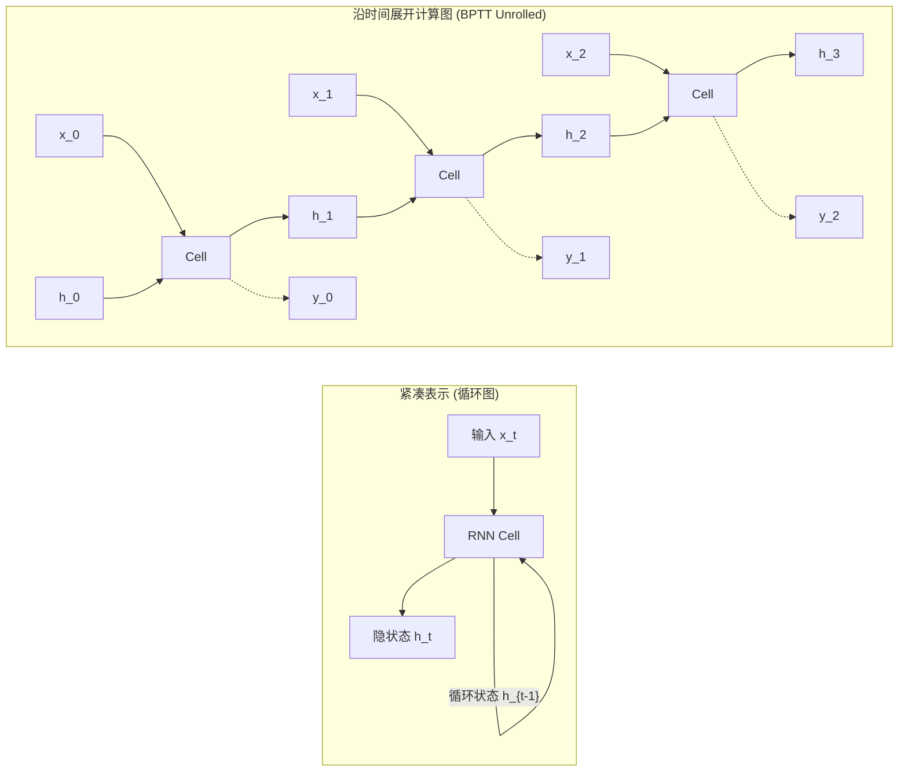
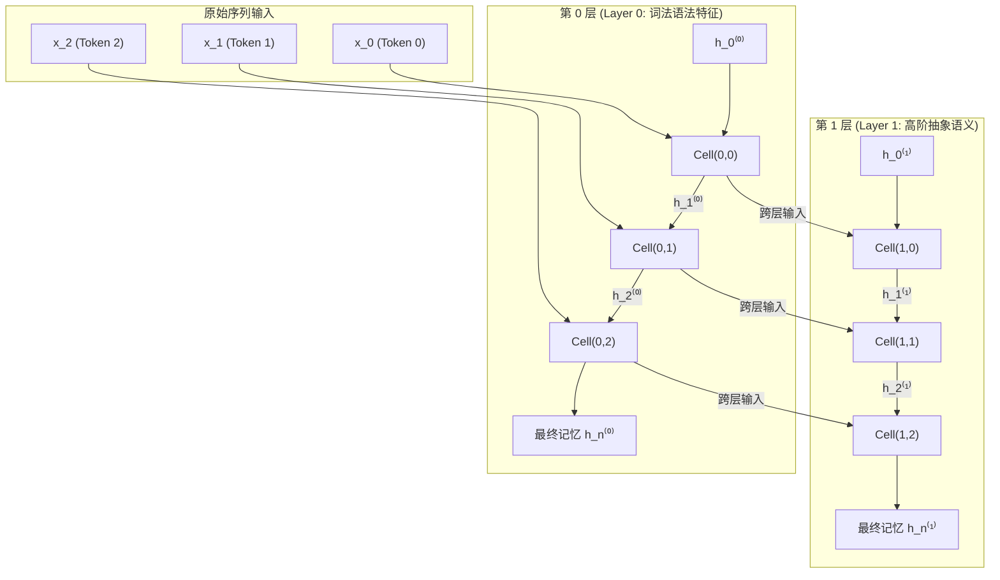
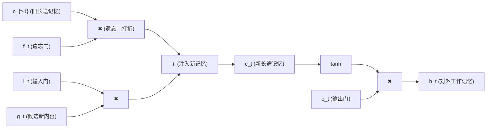

# 循环神经网络（RNN）与长短时记忆网络（LSTM）完全解析指南

---

## 目录
1. [范式转变：从静态空间（MLP/CNN）到动态时序（RNN）](#1-范式转变从静态空间mlpcnn到动态时序rnn)
2. [经典 RNN 的第一性原理与数学建模](#2-经典-rnn-的第一性原理与数学建模)
3. [时间反向传播（BPTT）与致命缺陷：梯度消失与爆炸](#3-时间反向传播bptt与致命缺陷梯度消失与爆炸)
4. [革命性架构：LSTM（长短时记忆网络）的设计哲学](#4-革命性架构lstm长短时记忆网络的设计哲学)
5. [深度学习系统级工程实现与高频陷阱剖析](#5-深度学习系统级工程实现与高频陷阱剖析)
6. [全景对比总结与速查清单](#6-全景对比总结与速查清单)

---

## 1. 范式转变：从静态空间（MLP/CNN）到动态时序（RNN）

在进入复杂的公式和代码前，我们必须从第一性原理回答：**为什么我们已经有了强大的全连接网络（MLP）和卷积网络（CNN），却还要大费周章发明 RNN？**

### 1.1 前馈网络在时序任务上的三大死穴

| 维度 | MLP / CNN 的局限 | 时序数据（文本/语音/时间序列）的客观现实 |
| :--- | :--- | :--- |
| **输入长度** | 固定输入尺寸（如 $32 \times 32$ 图像或 784 维向量）。超出或不足必须强行裁剪/补零。 | **动态可变**。一句话可以只有 3 个词（“我爱你”），也可以有 100 个词。 |
| **位置与置换** | 对输入维度的顺序不具备原生时序感知。 | **强时序因果性**。“狗咬人”与“人咬狗”单词完全一样，但含义截然相反。 |
| **长程依赖** | 感受野受限或全连接参数爆炸。 | **跨时间关联**。第 1 个词的主语（“小明”）可能决定第 50 个词的代词（“他”）。 |

### 1.2 参数共享哲学：从“空间平移不变性”到“时间平移不变性”

- **CNN 的权重共享**：无论猫出现在图片的左上角还是右下角，同一个卷积核都能识别出猫耳朵（**空间不变性**）。
- **RNN 的权重共享**：无论“吃”这个动作发生在句子的第 2 个位置（“小明**吃**苹果”）还是第 5 个位置（“昨天下午小明**吃**苹果”），动词对宾语的约束规则是完全相同的（**时间不变性**）。

因此，RNN 抛弃了“每个时间步都分配一套新权重”的愚蠢想法，转而采用**同一套参数在时间维度上反复循环套用**的设计。

---

## 2. 经典 RNN 的第一性原理与数学建模

### 2.1 物理直觉：什么是隐状态（Hidden State $h_t$）？

RNN 的核心定义是一个**动力学系统（Dynamical System）**：
- 在每一个离散时间步 $t$，系统维持一个内部状态向量 $h_t \in \mathbb{R}^{H}$（称为隐状态，Hidden State）。
- **隐状态 $h_t$ 的物理本质**：是模型对过去所有历史信息（$x_0, x_1, \dots, x_t$）的**有损压缩摘要（Lossy Summary）**。



### 2.2 单步更新公式（RNNCell）

在时间步 $t$，模型接收两个输入：
1. 当前时刻的外部输入：$x_t \in \mathbb{R}^{B \times D}$（$B$ 为 batch size，$D$ 为 input_size）。
2. 上一时刻遗留的记忆：$h_{t-1} \in \mathbb{R}^{B \times H}$（$H$ 为 hidden_size）。

更新方程为：
$$z_t = x_t W_{ih} + b_{ih} + h_{t-1} W_{hh} + b_{hh}$$
$$h_t = \tanh(z_t)$$

#### 权重矩阵维度与物理分工：
- **$W_{ih} \in \mathbb{R}^{D \times H}$**（输入到隐藏）：将外部世界维度的特征投影到大脑记忆空间。
- **$W_{hh} \in \mathbb{R}^{H \times H}$**（隐藏到隐藏）：对旧记忆进行线性变换（类似记忆的整理、衰减和重构）。
- **$b_{ih}, b_{hh} \in \mathbb{R}^{H}$**：各自的偏置项。两者数学上可以合并，但在工程（如 PyTorch）中分别设置，便于分别初始化与独立正则化。
- **$\tanh$ 激活函数**：将数值强行压缩至 $(-1, 1)$，防止记忆在循环中无节制发散。

---

### 2.3 二维时空展开：多层 RNN（Multi-layer RNN）

单层 RNN 只能提取初级上下文。为了构建深层抽象，我们将多个 RNN 沿**垂直方向（深度）**进行堆叠。

此时信息流动形成了极其规整的**二维网格**：
- **横向（时间轴 $t = 0 \to T-1$）**：记忆在同一层内顺时针流淌（从过去到未来）。
- **纵向（层数轴 $l = 0 \to L-1$）**：低层细胞提取的表征作为高层细胞的输入（从具象到抽象）。



#### 层间传递数学公式：
对于第 $l$ 层（$l \ge 1$）：
$$x_t^{(l)} = h_t^{(l-1)}$$
$$h_t^{(l)} = \tanh\left( x_t^{(l)} W_{ih}^{(l)} + b_{ih}^{(l)} + h_{t-1}^{(l)} W_{hh}^{(l)} + b_{hh}^{(l)} \right)$$

> [!NOTE]
> **关键形状规律**：
> - 第 0 层：$W_{ih}^{(0)}$ 的形状是 `(input_size, hidden_size)`。
> - 第 $l \ge 1$ 层：因为输入来自上一层的隐状态，所以 $W_{ih}^{(l)}$ 的形状是 `(hidden_size, hidden_size)`。
> - 序列长度 $T$ 在每一层中**完全保持不变**，每个时刻 $t$ 每一层都会产生一个状态 $h_t^{(l)}$。

---

## 3. 时间反向传播（BPTT）与致命缺陷：梯度消失与爆炸

经典 RNN 在理论上能够捕捉无限长的依赖，但工业界在实践中发现：**一旦序列长度超过 10 到 20 个时间步，经典 RNN 的表现便会断崖式下跌。** 

这并非算力不足，而是源于底层数学梯度的病态行为。

### 3.1 数学严格推导：跨时间步求导链条

设总损失函数为 $L = \sum_{t=1}^T L_t$。考虑在最后时刻 $T$ 的损失 $L_T$ 对很久以前某个时刻的隐状态 $h_t$（$t \ll T$）的偏导数。

根据微积分链式法则：
$$\frac{\partial L_T}{\partial h_t} = \frac{\partial L_T}{\partial h_T} \cdot \frac{\partial h_T}{\partial h_t}$$

其中，状态转移的雅可比矩阵（Jacobian）展开为长达 $T-t$ 项的**连乘积**：
$$\frac{\partial h_T}{\partial h_t} = \prod_{k=t+1}^T \frac{\partial h_k}{\partial h_{k-1}}$$

回顾单步方程 $h_k = \tanh(x_k W_{ih} + h_{k-1} W_{hh})$，雅可比矩阵单项为：
$$\frac{\partial h_k}{\partial h_{k-1}} = \operatorname{diag}\left( 1 - h_k^2 \right) \cdot W_{hh}^T$$

将所有时间步代入连乘式：
$$\frac{\partial h_T}{\partial h_t} = \prod_{k=t+1}^T \left[ \operatorname{diag}\left( 1 - h_k^2 \right) W_{hh}^T \right]$$

### 3.2 崩溃的物理本质分析

请仔细观察连乘项中的两个因子：

1. **激活函数导数因子 $\operatorname{diag}(1 - h_k^2)$**：
   - 激活函数为 $\tanh$，其导数恒满足：$\tanh'(z) = 1 - \tanh^2(z) \in (0, 1]$。
   - 只有在输入恰好为 0 时导数才为 1，只要神经元进入饱和区，导数便远小于 1（例如 0.2 甚至 0.01）。
   - 将数十个小于 1 的数字相乘：$0.2^{30} \approx 10^{-21}$，梯度直接归零！
2. **权重矩阵因子 $W_{hh}^T$**：
   - 设 $W_{hh}$ 的最大特征值为 $\lambda_{\max}$。
   - 矩阵在数十次幂运算后：$\| W_{hh}^{T-t} \| \propto (\lambda_{\max})^{T-t}$。
   - 若 $\lambda_{\max} < 1$：呈指数级衰减至 0（**梯度消失 Vanishing Gradient**）。此时模型完全无法把末端的报错信息传递给开头的神经元，模型患上**重度健忘症**。
   - 若 $\lambda_{\max} > 1$：呈指数级放大至无穷大（**梯度爆炸 Exploding Gradient**）。此时权重剧烈震荡，数值溢出报 `NaN`。

---

## 4. 革命性架构：LSTM（长短时记忆网络）的设计哲学

为了彻底攻克链式连乘导致的梯度消失，Sepp Hochreiter 与 Jürgen Schmidhuber 于 1997 年提出了 **LSTM（Long Short-Term Memory）**。

### 4.1 核心顿悟：从“相乘变换”改为“恒等相加”

经典 RNN 之所以梯度消失，是因为记忆更新是**乘法性**的：$h_t = \tanh(W h_{t-1} + \dots)$。
如果想要梯度跨越 100 个时间步依旧不衰减，最完美的导数应该是什么？
$$\frac{\partial \text{State}_t}{\partial \text{State}_{t-1}} \approx 1.0$$

LSTM 的破局之策：**在网络内部铺设一条高速公路 —— 细胞状态（Cell State $c_t$）**。



在 $c_{t-1}$ 到 $c_t$ 的主线路上，**没有矩阵乘法，没有激活函数压缩，核心运算全部是线性加法**！信息可以像在无阻力冰面上滑行一样，毫发无损地传向未来。

---

### 4.2 双轨状态与四大门控的完整数学推导

LSTM 在每个时刻同时维护两个向量：
- **$c_t \in \mathbb{R}^{B \times H}$（Cell State，长程记忆）**：负责跨时空的长远记忆保存。
- **$h_t \in \mathbb{R}^{B \times H}$（Hidden State，短程工作记忆）**：负责与外界输入交互并产生当前输出。

为了精确调控长程传送带 $c_t$ 上的信息，LSTM 设立了 **4 个门控机制**：

#### 门控 1：遗忘门（Forget Gate $f_t$）
- **物理含义**：审视过去的旧长程记忆 $c_{t-1}$，决定其中百分之多少需要被抹除。
- **公式**：
  $$f_t = \sigma(x_t W_{if} + b_{if} + h_{t-1} W_{hf} + b_{hf})$$
  *(其中 $\sigma$ 为 Sigmoid 函数，值域严格在 $(0, 1)$。$f_t \to 0$ 为完全遗忘，$f_t \to 1$ 为完全保留)*

#### 门控 2：输入门（Input Gate $i_t$）
- **物理含义**：审视当前看到的新输入 $x_t$，决定有多大的意愿将新信息写入长程传送带。
- **公式**：
  $$i_t = \sigma(x_t W_{ii} + b_{ii} + h_{t-1} W_{hi} + b_{hi})$$

#### 门控 3：候选记忆元（Candidate Cell State $g_t$）
- **物理含义**：结合当前输入 $x_t$ 与工作记忆 $h_{t-1}$，提取出**具体要记录的新知识内容**。
- **公式**：
  $$g_t = \tanh(x_t W_{ig} + b_{ig} + h_{t-1} W_{hg} + b_{hg})$$
  *(用 $\tanh$ 压缩至 $(-1, 1)$，表示新特征的强弱方向)*

#### 传送带更新（Cell State Update $c_t$）
- **物理含义**：旧记忆打折保留，新知识按比例注入。**这是 LSTM 不发生梯度消失的灵魂公式**：
  $$c_t = f_t \odot c_{t-1} + i_t \odot g_t$$
  *(其中 $\odot$ 为逐元素相乘 Element-wise Multiplication)*

#### 门控 4：输出门（Output Gate $o_t$）与隐状态（$h_t$）
- **物理含义**：从整理好的长程记忆 $c_t$ 中，筛选出当下这一刻需要表现出来的部分，作为工作记忆 $h_t$。
- **公式**：
  $$o_t = \sigma(x_t W_{io} + b_{io} + h_{t-1} W_{ho} + b_{ho})$$
  $$h_t = o_t \odot \tanh(c_t)$$

---

### 4.3 为什么 LSTM 能够解决梯度消失？（反向求导视角）

现在我们考察 LSTM 中 $c_t$ 对前一时刻状态 $c_{t-1}$ 的偏导数：
$$\frac{\partial c_t}{\partial c_{t-1}} = f_t + \dots$$

在反向传播的长链条中：
$$\frac{\partial c_T}{\partial c_t} = \prod_{k=t+1}^T \frac{\partial c_k}{\partial c_{k-1}} \approx \prod_{k=t+1}^T f_k$$

**神来之笔出现了：**
- $f_k$ 的取值是由网络**自主学习动态控制**的！
- 如果遗忘门学习到令 $f_k \approx 1$（例如对于重要主语），那么这部分的连乘项：
  $$\prod_{k=t+1}^T 1.0 = 1.0$$
- **梯度完全不衰减！** 100 步以前的梯度可以原汁原味地倒流回最初时刻，彻底根治了梯度消失！

---

## 5. 深度学习系统级工程实现与高频陷阱剖析

在理论转化为代码的过程中，工业级实现（如 PyTorch / cuDNN / Needle）充满了极其考究的系统工程优化。

### 5.1 4倍并行的“大矩阵融合技巧（Fused Projections）”

初学者常犯的低效写法：分别对 $i, f, g, o$ 创建 4 组独立的 Linear 层：
```python
# 极其低效的写法 (触发 8 次小矩阵乘法与多次 GPU Kernel 启动)
gates_i = x @ W_i + h @ W_hi
gates_f = x @ W_f + h @ W_hf
gates_g = x @ W_g + h @ W_hg
gates_o = x @ W_o + h @ W_ho
```

**现代深度学习系统的标准优化**：
将 4 个门控的权重在列方向上无缝拼合为一个**4倍宽度的超大矩阵**：
$$W_{ih} \in \mathbb{R}^{D \times 4H}, \quad W_{hh} \in \mathbb{R}^{H \times 4H}, \quad b_{ih}, b_{hh} \in \mathbb{R}^{4H}$$

此时只需启动 **2 次大矩阵乘法**（BLAS GEMM 极致优化）：
$$\text{Gates} = x W_{ih} + h W_{hh} + b_{ih} + b_{hh} \quad \in \mathbb{R}^{B \times 4H}$$

### 5.2 拆解 4H：内存布局与多维 Split 机制

得到 $\text{Gates} \in \mathbb{R}^{B \times 4H}$ 后，如何切分成 4 个门？

在连续物理内存中，列排列规则为：
- 列 $0 \dots H-1$：输入门 $i$
- 列 $H \dots 2H-1$：遗忘门 $f$
- 列 $2H \dots 3H-1$：候选门 $g$
- 列 $3H \dots 4H-1$：输出门 $o$

在没有切片赋值语法的张量库（如 Needle）中，最优雅的拆分策略是**先升维，再切分**：
```python
# 1. 将 (B, 4*H) 重构为 (B, 4, H)
gates_3d = gates.reshape((bs, 4, self.hidden_size))

# 2. 沿着第 1 维 (大小为 4 的轴) 进行 split，降维消除该轴
i, f, g, o = ops.split(gates_3d, axis=1) # 得到 4 个形状皆为 (B, H) 的张量！
```

### 5.3 偏置广播的底层维度约束

在 Needle 等底层算子库中，`NDArray.broadcast_to` 要求源张量与目标张量的**维度数必须严格相等**：
- `bias` 的存储形状为 1D：`(4H,)`
- `gates` 的前向形状为 2D：`(B, 4H)`

直接 `bias.broadcast_to((B, 4H))` 会在 C++/CUDA 底层报断言错误（无法将 1 维广播到 2 维）。
**必须先进行显式维度对齐**：
```python
b = (self.bias_ih + self.bias_hh).reshape((1, 4 * self.hidden_size))
gates = gates + b.broadcast_to(gates.shape)
```

---

## 6. 全景对比总结与速查清单

### 6.1 五大主流架构特性横向对比

| 架构 | 状态数量 | 梯度流动途径 | 长程依赖能力 | 计算并行度 | 核心适用场景 |
| :--- | :--- | :--- | :--- | :--- | :--- |
| **MLP** | 无状态 | 前馈直连 | 极弱（无时序） | 极高（单步全并行） | 表格数据、输出分类头 |
| **CNN** | 无状态 | 前馈局部卷积 | 弱（需靠堆深膨胀感受野） | 极高（空间滑窗全并行） | 图像网格、局部模式识别 |
| **Vanilla RNN** | 单状态 ($h$) | 乘法链式连乘 | 极差（$<15$ 步，易梯度消失） | 差（沿时间强串行依赖） | 教学演示、超短平稳信号 |
| **LSTM** | 双状态 ($h, c$) | **加法线性传送带** | **极强（数千步无衰减）** | 差（沿时间强串行依赖） | 中长文本、语音信号、小样本序列 |
| **Transformer**| 无内部隐状态 | 全局注意力直连 | 极其强大（依赖注意力窗口） | **极高（训练期全序列并行）**| 大语言模型、大规模预训练 |

---

### 6.2 经典张量形状流转速查表（Tensor Shape Cheat Sheet）

以批量大小 $B$、序列长度 $T$、输入维度 $D$、隐层维度 $H$、层数 $L$ 为例：

```
========================================================================================
阶段                张量变量名          形状 (Shape)                 物理语义
========================================================================================
输入总装            X                  (T, B, D)                   整批完整时序长文本
输入初始状态        h0 (RNN)           (L, B, H)                   每层的初始隐状态
                    (h0, c0) (LSTM)    2个 (L, B, H)               每层的初始工作记忆与传送带
----------------------------------------------------------------------------------------
时间拆分            inputs             T 个长度的 List[(B, D)]     每个独立时刻的词特征切片
单步线性投影        X @ W_ih           (B, 4H)                     LSTM 一次性计算 4 门
门控解耦            i, f, g, o         4 个独立的 (B, H)           各司其职的门控激活值
传送带更新          c_prime            (B, H)                      下一时刻的长程记忆
工作记忆更新        h_prime            (B, H)                      下一时刻的对外暴露记忆
----------------------------------------------------------------------------------------
最终输出组装        output             (T, B, H)                   顶层在全部时刻的特征轨迹
                    h_n                (L, B, H)                   各层在最后一刻的终态记忆
========================================================================================
```
